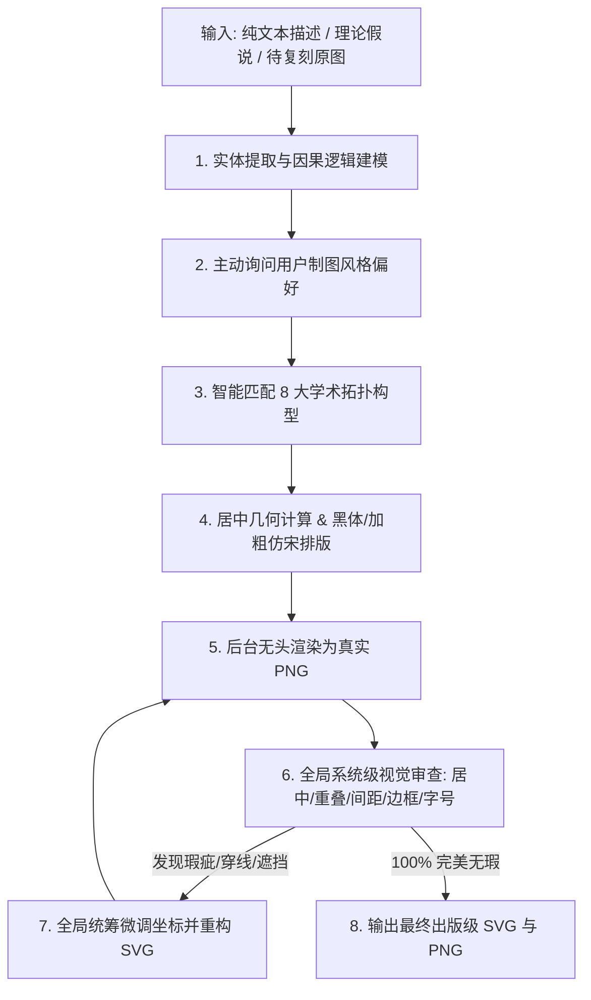

# 社科学术机制图矢量设计引擎 (Paper Mechanigraph 4SS)

> **CSSCI / SSCI 顶刊级社科学术机制图纯矢量 SVG 自动化生成、复刻与视觉自检修复引擎**

---


## 📖 目录 (Table of Contents)

- [一、项目概述](#一项目概述)
- [二、核心能力与特性](#二核心能力与特性)
- [三、核心工作流程](#三核心工作流程)
- [四、8 大学术因果机制构型库](#四8-大学术因果机制构型库)
- [五、不可逾越的制图红线与排版铁律 (16 条法则)](#五不可逾越的制图红线与排版铁律-16-条法则)
- [六、目录结构说明](#六目录结构说明)
- [七、快速开始与使用指南](#七快速开始与使用指南)
  - [1. 在 Agent / AI 编程助手中使用](#1-在-agent--ai-编程助手中使用)
  - [2. 命令行与 Python 脚本工具](#2-命令行与-python-脚本工具)
- [八、样例展示](#八样例展示)
- [九、贡献与规范维护](#九贡献与规范维护)

---

## 一、项目概述

**`paper-mechanigraph-4ss`** 是专门面向社科学术论文（管理学、社会学、政治学、经济学、公共管理等）的理论机制图矢量设计与生成引擎。

传统制图工具（如 PPT、Visio、ProcessOn、Draw.io）在论文排版时常存在**文字穿透连线、留白不均、样式花哨反差过大、字号混乱、导出位图模糊**等问题。本项目制定了一整套严苛契合顶级期刊（CSSCI / SSCI）出版规范的几何参数标准与设计系统，支持：

1. **纯文本驱动出图**：输入文字描述、假说推演或因果逻辑，自动提炼拓扑并生成专业机制图；
2. **原图精准复刻**：将文献中的扫描低清图、草图转换为高分辨率纯矢量 SVG；
3. **视觉闭环自检**：出图后通过无头浏览器渲染与多维度系统性审查，发现蹭线、溢出、遮挡自动修复，确保交付即出版级。

---

## 二、核心能力与特性

- 🎯 **纯文字转译因果构型 (Text-to-Diagram Engine)**  
  自动解析文本中的概念实体、传导链路、中介机制与调节效应，智能匹配经典学术拓扑。
- 🤝 **出图前风格主动询问交互 (Pre-flight Style Inquiry)**  
  不擅自替用户决策，出图前向用户确认拓扑流派、外围大边框样式（实线/虚线/无边框开放式）及连线风格。
- 📐 **16 项严苛排版铁律守护 (16 Immutable Rules)**  
  涵盖纯白底黑字、黑体大字号层级、仿宋次级标注、曲线安全净空、防穿刺走廊、坐标全域配平等。
- 🔄 **强制无头渲染视觉自检闭环 (Mandatory Verification Loop)**  
  后台利用 Selenium/Chrome Headless 渲染真实 PNG，核验间距、对称性、字号与连线，自主迭代修正。
- 📦 **动态自适应固定画布体系 (Dynamic Viewport Sizing)**  
  杜绝全局写死比例，按节点规模自动适配 `900x600`、`1320x720`、`1200x650`、`900x1000` 或 `800x800`，物理像素与 viewBox 严格 1:1 绑定。

---

## 三、核心工作流程



---

## 四、8 大学术因果机制构型库

| 构型名称                                                  | 适用因果逻辑与典型场景                                   | 标准画布与核心布局                                           |
| :-------------------------------------------------------- | :------------------------------------------------------- | :----------------------------------------------------------- |
| **1. 时序因果链**<br>*(Sequential Pipeline)*              | 输入-动因-过程-产出-反馈、C-M-A-O 模型、政策推进演进     | `900 x 600` / 水平 3~5 阶段卡片并列 + 底部长反馈虚线回路     |
| **2. 多层级纵向传导架构**<br>*(Hierarchical Framework)*   | 宏观环境-中观机制-微观行动、自上而下政策执行、多尺度治理 | `900 x 600` 或 `900 x 1000` / 垂直 3~4 层大容器，粗垂直箭头贯通 |
| **3. 多元主体网络与博弈拓扑**<br>*(Multi-Actor Network)*  | 政产学研多方协同、行动者网络 (ANT)、三元博弈、网络化治理 | `900 x 600` 或 `800 x 800` / 正多边形圆周对称分布 + 中心治理中枢 |
| **4. 多力向心汇聚动力学**<br>*(Centripetal Convergence)*  | 顶层牵引力、内在驱动力、外在拉动力、底层助推力协同驱动   | `900 x 600` / 中心目标核心 + 上下左右四向发力卡片向心聚合    |
| **5. 二维坐标演进阶梯**<br>*(Coordinate Steps & S-Curve)* | 阶段跃迁、能力爬坡、数字化转型阶段演进、S 型生命周期     | `900 x 600` / 原点坐标系 + 对角线阶梯抬升 + 悬空平滑演进曲线 |
| **6. 闭环循环与卫星运转**<br>*(Closed-Loop Circulation)*  | 绿色循环经济、资源全生命周期闭环、要素循环再生           | `900 x 600` 或 `800 x 800` / 核心中枢 + 4 卫星外围大圆弧顺时针流动 |
| **7. 双核双轨耦合对偶**<br>*(Dual-Core Coupling)*         | 双轮驱动、技术与制度双轨推进、供需对接与匹配机制         | `900 x 600` 或 `1320 x 720` / 左右对称双系统推进 + 中轴耦合互动走廊 |
| **8. 四象限矩阵与交叉分类**<br>*(2x2 Matrix & Typology)*  | 两维度四类型划分、策略选择矩阵、主体行为类型学           | `900 x 600` / 十字交叉坐标系 + 四象限宽卡片特征解构          |

---

## 五、不可逾越的制图红线与排版铁律 (16 条法则)

1. **绝对禁止图表标题与边角注释**：严禁内嵌"图1"、"机制图"、"作者自制"等字样，留给论文正文排版。
2. **纯粹白底黑字规范**：严禁使用彩色、灰色底色（`#eeeeee`、`#f5f5f5` 等全部废弃），图形 `fill="#ffffff"`，线条与文字统一为纯黑 `#000000`。
3. **字体栈与层级排版**：
   - **核心强调项**：标准黑体 (`SimHei`, `Microsoft YaHei`)，**不加粗**，仅通过大字号 (`20px ~ 24px`) 突出；
   - **次级非强调项**：加粗仿宋体 (`FangSong`, `STFangsong`, `font-weight="bold"`)，字号 `14px ~ 16px`；
   - **英文/数字**：`Times New Roman`, `Arial`。
4. **动态固定画布与绝对居中**：物理尺寸 `width/height` 与 `viewBox` 严格 1:1 绑定（严禁 `width="100%"`），四向留白对称。
5. **曲线安全净空 (≥35px~50px)**：跨实体演进曲线/回路必须悬浮于卡片顶端上方，严禁穿透卡片或切割文字。
6. **文字与图形黄金间距**：卡片文字内边距保留 `12px ~ 20px`；水平连线文字离线 `8px ~ 12px`；多行行距 `22px ~ 28px`。
7. **斜线/曲线上方文字净空 (Slope Clearance)**：文字包围盒任意角与斜线/曲线保持至少 `25px ~ 40px` 净空，严禁蹭线。
8. **实体间呼吸间距**：相邻卡片/圆环/分箱间保持 `20px ~ 45px` 物理间隙，严禁无缝相切挤压；外大边框预留 `≥35px` 呼吸带。
9. **全局空间分层预算**：严格划分顶部趋势带、中部实体带、底部基线带，调整一处整体联动。
10. **连线侧边标注显式对齐**：竖直/倾斜连线左侧文本显式声明 `text-anchor="end"`，右侧声明 `text-anchor="start"`，杜绝穿线。
11. **跨层纵向实体净空 (≥70px)**：双向纵向箭头起点终点与边框保留 `6px ~ 8px` 衬垫，严禁箭头刺入框体。
12. **跨系统长连接走廊**：标注文字须位于正中空旷走廊，距离任何容器边界保持 `≥35px`。
13. **箭头起点零三角与双向双线**：单向线仅允许在终点设置 `marker-end`，严禁 `marker-start`；双向交互采用两条平行单向线。
14. **左右双系统全域配平**：左右外边距严格对称（`Margin_Left ≈ Margin_Right ≈ 40px`）。
15. **文本包围盒防溢出公式**：`W_text + 2 × Padding_safe ≤ W_container`，长标题必须降字号（`13.5px ~ 14px`）或折行。
16. **零穿刺徽标与 DOM 顺序**：跨层连线禁止穿越容器标题徽标；SVG DOM 顺序中连线置于实体之前，结合白底遮罩保护。

---

## 六、目录结构说明

```plaintext
paper-mechanigraph-4ss/
├── SKILL.md                          # 核心技能定义与执行协议规范
├── README.md                         # 项目全景说明文档
├── references/                       # 核心设计系统与拓扑参考库
│   ├── design_system.md              # 矢量设计系统（坐标规范、组件库、防穿透公式）
│   ├── drawing_patterns_reference.md # 8 大学术拓扑构型几何参数与转译指南
│   └── layout_catalog.md             # 拓扑分类名录与动态初筛提炼协议
├── scripts/                          # 核心工具链与无头渲染器
│   ├── render_svg.py                 # 基于 Selenium/Headless Chrome 的无头 SVG 转 PNG 渲染器
│   ├── generate_mechanism.py         # 机制图生成脚本示例
│   ├── batch_process_images.py       # 多图批量逆向复刻与验证执行器
│   └── extract_layouts.py            # 拓扑分析提取工具
├── resources/                        # 共享资源
│   └── academic_defs.svg             # 标准箭头标记与 SVG defs 预设
└── examples/                         # 出版级标准 SVG 样例库
    ├── example_001_four_forces_convergence.svg      # 四力向心汇聚图
    ├── example_003_policy_network.svg               # 政策网络与多主体博弈图
    ├── example_004_policy_actors_nexus.svg          # 政策行动者纽带架构图
    ├── example_005_dual_system_governance.svg       # 双系统协同治理图
    ├── example_026_land_remediation_cards.svg       # 流程分箱卡片图
    ├── example_060_digital_accountability_steps.svg # 阶梯演进与跃迁图
    ├── example_065_gear_effect.svg                  # 齿轮咬合驱动效应图
    └── example_100_natural_resource_loop.svg        # 资源闭环循环图
```

---

## 七、快速开始与使用指南

### 1. 在 Agent / AI 编程助手中使用

安装或加载本 Skill 后，直接在对话框输入学术机制描述或提供待复刻图片即可触发：

```text
# 示例 1: 纯文字生成
请为我绘制一个“数字乡村治理中的政社协同机制图”，包含宏观制度环境、
中观平台赋能与微观农户参与三层结构，并体现数字红利的反馈调节。

# 示例 2: 原图复刻
请帮我复刻这张机制图（提供图片路径或附件），按 CSSCI 出版标准重新绘制为矢量 SVG。
```

### 2. 命令行与 Python 脚本工具

#### 环境依赖

本项目内置无头渲染自检工具依赖 Python 3.8+ 及 Google Chrome：

```bash
pip install selenium webdriver-manager
```

#### 无头渲染自检 (SVG -> PNG)

将生成的 SVG 转换为 1:1 高清 PNG 进行人工或自动化视觉审查：

```bash
python scripts/render_svg.py examples/example_001_four_forces_convergence.svg output.png
```

#### 基础因果链生成示例

```bash
python scripts/generate_mechanism.py --type pipeline --output my_pipeline.svg
```

---

## 八、样例展示

在 `examples/` 目录下收录了 8 种经典拓扑构型的标准 SVG 文件，可使用浏览器或矢量设计软件（Illustrator、Inkscape 等）直接打开预览：

- `example_001_four_forces_convergence.svg`：四力向心辐射动力学模型
- `example_003_policy_network.svg`：多元主体网络与博弈拓扑模型
- `example_005_dual_system_governance.svg`：左右双系统耦合治理架构模型
- `example_060_digital_accountability_steps.svg`：二维坐标阶梯演进模型
- `example_100_natural_resource_loop.svg`：闭环循环与卫星运转模型

---

## 九、贡献与规范维护

如果您在论文写作或制图实践中发现了新的典型机制图拓扑或更优的几何参数配置，欢迎提交 Issue 或 Pull Request：

- 请确保新增构型符合 **16 条不可逾越的排版铁律**；
- 遵循纯白底黑字、黑体大字号强调与仿宋次级排版规范；
- 提交前请使用 `scripts/render_svg.py` 完成无头渲染验证。
