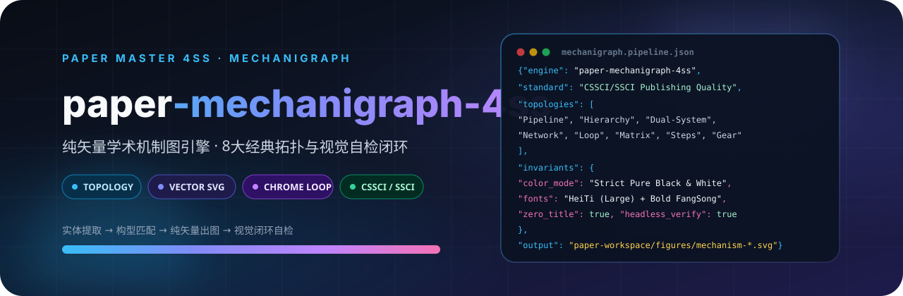

<p align="center">
  
</p>

# Paper 学术机制图 4SS

社科学术机制图（理论机制图、分析框架图、演进模型、政策网络、治理体系）的纯矢量 SVG 自动化生成、复刻与自检修复引擎。按 CSSCI/SSCI 期刊出版标准，出图前主动询问用户制图风格偏好，将文字描述/理论假说解析为机制图，或复刻已有原图，出图后后台无头渲染 PNG 视觉自检直至完美。当用户需要生成学术机制图、把机制描述/理论假说转为图示、复刻或重绘某张机制图时使用。

## 4SS 家族

| 包 | 职责 |
|---|---|
| [paper-master-4ss](https://github.com/JingYangYuan/paper-master-4ss) | 总控：登记输入、选择模块、维护工作区 |
| [paper-design-4ss](https://github.com/JingYangYuan/paper-design-4ss) | 选题、框架路由、研究设计蓝图 |
| [paper-lit-4ss](https://github.com/JingYangYuan/paper-lit-4ss) | 中英文检索、文献地图、空白与假设 |
| [paper-outline-4ss](https://github.com/JingYangYuan/paper-outline-4ss) | 素材转大纲、证据映射、缺口报告 |
| [paper-analysis-4ss](https://github.com/JingYangYuan/paper-analysis-4ss) | 定量 / 质性 / 混合，Stata · R · Python |
| [paper-write-4ss](https://github.com/JingYangYuan/paper-write-4ss) | 章节写作、润色、语言扫描、正文净稿 |
| [paper-check-4ss](https://github.com/JingYangYuan/paper-check-4ss) | 全文审稿、质量门控与精确回流 |
| [paper-submission-4ss](https://github.com/JingYangYuan/paper-submission-4ss) | Word 导出、体例、投稿清单与信函 |
| [paper-update-4ss](https://github.com/JingYangYuan/paper-update-4ss) | 待审核更新包，不直接改核心文件 |
| **[paper-mechanigraph-4ss](https://github.com/JingYangYuan/paper-mechanigraph-4ss)**（本仓库） | 纯矢量学术机制图生成、拓扑匹配与视觉自检 |

## 它做什么

面向社科学术期刊（CSSCI / SSCI）出版标准，将文字描述、理论假说解析为纯矢量 SVG 学术机制图（理论机制图、分析框架图、因果演化模型、政策网络、治理体系），或将已有原图精确复刻为标准矢量图。

出图前通过 `ask_user` 主动询问用户制图风格偏好（构型流派、大外框样式、连线分箱风格），出图后通过后台无头 Chrome 渲染真实 PNG 进行视觉自检微调闭环，确保 100% 完美无瑕。

## 核心能力

| 能力 | 说明 |
|---|---|
| 8大经典拓扑 | 流水线时序、纵向层级、对偶双系统、多主体网络、闭环回路、矩阵四象限、阶梯演进、齿轮啮合 |
| 纯矢量规范 | 纯白底纯黑字、大号黑体（无加粗）主概念、加粗仿宋次级说明、零灰色填充、绝对居中 |
| 强制自检闭环 | 跨平台无头 Chrome 驱动自动渲染 PNG 视觉复核，自查防蹭线、防穿透、间距与留白 |

## 安装

将本目录放到宿主的 skill 目录。入口见 `SKILL.md`。

```bash
git clone https://github.com/JingYangYuan/paper-mechanigraph-4ss.git
```

与 [`paper-master-4ss`](https://github.com/JingYangYuan/paper-master-4ss) 同级安装时，跨模块路径才能解析。只做本模块任务也可以单独使用。

## 与总控的关系

本包由总控 [`paper-master-4ss`](https://github.com/JingYangYuan/paper-master-4ss) 导出；对应源目录是总控包内的 `modules/mechanigraph/`：

- 包内相对路径相对本包根目录解析
- `master/` 与部分 `references/` 是导出时的协议快照
- 更新方式：修改总控任一模块、家族表、路由或协议后，必须无参数重新导出**全部**独立包并 push 全部 GitHub 仓；不要只改本仓库，也不要只导出改过的那一个。

## License

[MIT](LICENSE)
