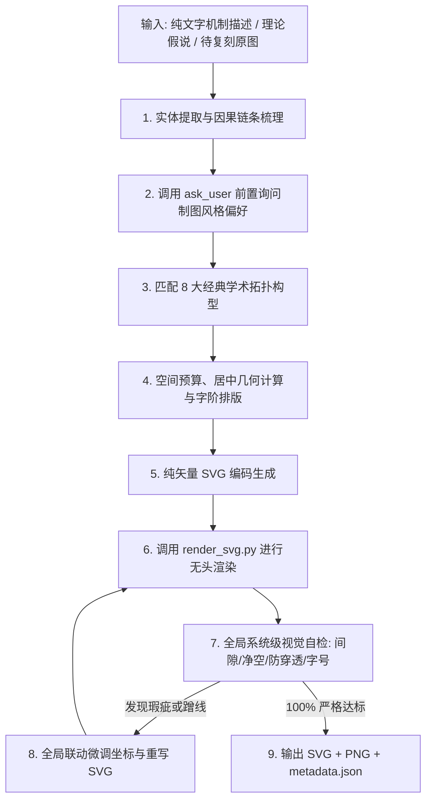

> **拆分版路径约定**：本包由 `paper-master-4ss/scripts/export_standalone.py` 从 `paper-master-4ss/modules/mechanigraph/` 自动导出，是可独立安装的运行版。包内相对路径（`agents/`、`phases/`、`references/`、`master/` 等）相对本包根目录解析；跨模块路径 `paper-master-4ss/modules/<x>/...` 相对同级安装的 `paper-master-4ss/` 总控包解析。请勿直接编辑本包：修改总控模块后重新导出。

# 社科学术机制图纯矢量设计引擎 (Mechanigraph)

本模块按照顶级学术期刊（CSSCI / SSCI）出版标准，为社会科学研究自动构建、复刻与自检**纯矢量学术机制图**（理论机制图、分析框架图、因果逻辑图、演进模型、政策网络、治理体系），输出纯净、高清晰度、可直接入版发表的 SVG 矢量图与渲染预览图。

## 模块定位与总控协同

作为 `paper-master-4ss` 的第 9 个专业子模块，本模块在总控工作流中承担专业图示出图与审图职能，与上下游模块建立标准交接协议：
- **上游连接 `design`（研究设计）**：在理论框架确定后，将核心概念、假设命题转化为全局理论分析框架图；
- **上游连接 `analysis`（经验分析）**：在实证回归、中介效应、调节效应或案例过程追踪完成后，将经验因果链条转化为实证机制图；
- **下游连接 `write`（论文写作）**：将生成的最终矢量产物与元数据直接交付正文插图排版区，提供规范的 Markdown 嵌入语句与图题排版建议；
- **产物标准统一纳管**：默认统一输出至 `paper-workspace/figures/`，受 `scripts/paper_master_guard.py` 的关键产物门控与质量审计。

## Canonical 智能体编排

本模块内置两个标准 canonical 角色，支持单代理流或多代理并发协作（参见 `agents/`）：
1. **`paper-mechanigraph-topology-consultant` (拓扑顾问)**：
   负责从文本或假说中提取核心因果实体（自变量、中介机制、调节条件、因变量），从 8 大经典学术拓扑中匹配最优构型，并制定出图前的风格偏好推荐选项。
2. **`paper-mechanigraph-svg-designer` (矢量设计专家)**：
   负责几何坐标计算、纯矢量 SVG 编码、黑体与仿宋字阶排版、严格零灰色红线把控，并调用无头 Chrome 进行 PNG 渲染与视觉自检微调闭环。

## 跨宿主通用能力调用约定

本模块遵循 `references/runtime-adapter.md` 与 `references/agent-software-adapters.md` 的抽象层规范，在不同宿主（Claude Code、OpenCode、Codex、ZCode、OMP、Antigravity）中统一调用：
- `ask_user`：向用户确认制图风格偏好（构型流派、外大边框样式、连线风格）；
- `read_file` / `write_file`：读取理论输入、样例参考与写入最终 SVG / JSON 产物；
- `run_shell`：调用 `scripts/render_svg.py` 驱动无头渲染器生成 PNG 用于视觉审查。

## 路径与产物契约

在 `paper-master-4ss` 体系下运行时，默认输出路径规则如下：
- **矢量主产物**：`paper-workspace/figures/mechanism-[slug]-[date].svg`
- **渲染预览图**：`paper-workspace/figures/mechanism-[slug]-[date].png`
- **元数据账本**：`paper-workspace/figures/mechanism-metadata-[slug]-[date].json`

单模块独立运行或复刻模式下，若未指定工作区，可输出到用户指定路径或当前目录 `figures/`。

---

## 核心工作流 (Text-to-Diagram & Replication Workflow)



---

## 一、出图前主动询问制图风格（必做交互）

**本技能要求在真正落笔出图前，主动向用户询问制图风格偏好**，把关键风格选择权交还给用户，避免生成后因风格不合预期而反复返工。

### 1. 询问方式

- **结构化交互宿主（Claude Code / OMP / Antigravity / ZCode）**：使用宿主提供的结构化问询工具（如 `AskUserQuestion`、`ask`、`ask_question`），单次提出 2~3 个问题，每题提供 2~3 个明确选项；
- **纯文本宿主（Codex 等）**：在单轮对话中自然语言一次性列出上述问题并给出建议选项，避免多次往复追问；
- **用户已给偏好时**：若用户指令中已明确指定构型或风格（例如“要实线外框”、“按双系统模型绘制”），跳过询问，直接采纳并在输出说明中复述。

### 2. 标准询问项

1. **拓扑构型流派**：
   - `自动匹配`（AI 依据文本逻辑自动从 8 大经典学术拓扑中挑选最适构型）；
   - `指定经典构型`（如：流水线时序模型 / 纵向层级架构 / 双系统对偶模型 / 多主体网络…）；
2. **外围大边框样式 (Outer Frame Style)**：
   - `实线大外框`：经典权威出版风，清晰界定系统边界；
   - `虚线大外框`：开放式环境与制度系统边界；
   - `无外围边框`：现代极简留白风，主体居中展开。
3. **分箱与连线风格 (Line Style Preference)**：
   - `实线为主`：刚健清晰；
   - `虚实结合`：核心实体实线，辅助路径/反馈回路/环境分箱用虚线。

---

## 二、不可逾越的制图红线与排版规范 (Immutable Design Rules)

### 1. 绝对禁止图表标题与边角注释
- 严禁在图内包含任何主标题（如"图1 XXX机制图"），图标题必须留给作者在论文正文排版中单独添加；
- 严禁出现"作者自制"、"数据来源"等说明字样。

### 2. 字体栈与字阶排版规范 (HeiTi & Bold FangSong)
- **核心强调项：标准黑体 (HeiTi)，不强制加粗，通过大字号突出**：
  - 主模块/核心概念/关键标题（强调项）：采用黑体，**不强制加粗 (`font-weight="normal"`)**，通过大字号（`20px ~ 24px`）实现层级区分；
  - 字体栈：`'SimHei', 'Heiti SC', 'Microsoft YaHei', sans-serif`；
- **次级非强调项：加粗仿宋体 (Bold FangSong)**：
  - 次级节点、括号指标、连线说明、细分参数（非强调项）：采用**加粗仿宋体 (`font-weight="bold"`)**，字号 `14px ~ 16px`；
  - 字体栈：`'FangSong', 'STFangsong', 'FangSong_GB2312', 'SimSun', serif`；
- **英文/数字**：`'Times New Roman', 'Arial', sans-serif`。

### 3. 严格纯粹白底黑字规范 (Strict Pure Black & White)
- **绝对禁用任何彩色与灰色/深色背景**：
  - 严禁使用深色/黑色背景块（严禁文字反白）；
  - 严禁使用浅灰色底色填充（如 `#f5f5f5`, `#eeeeee`, `#333333` 全部废弃）；
  - 所有图形容器/卡片填充：统一为**纯白** `fill="#ffffff"` 或透明 `fill="none"`；
  - 所有文本颜色：统一为**纯黑** `fill="#000000"`；
  - 所有线条与边框：统一为**纯黑** `stroke="#000000"`。

### 4. 动态自适应固定画布与绝对居中 (Dynamic Sizing & Fixed Viewport)
- **动态按需计算画布尺寸，严禁写死单一比例**：
  1. **标准 3:2 画布 (`900 x 600` ~ `960 x 640`)**：适用于常规 4~6 节点的动力学、网络或对偶模型；
  2. **大型三元/多元综合治理架构 (`1320 x 720`)**：适用于"左困境/起点 + 中部复合机制体系 + 右产出/效能 + 底部反馈回路"的顶刊宏大分析框架；
  3. **宽幅长时序因果链 (`1200 x 650` ~ `1400 x 750`)**：适用于 5~7 阶段的长流程横向流水线；
  4. **纵向深层级架构 (`900 x 1000` ~ `1000 x 1200`)**：适用于 4~6 层自上而下的宏-中-微观纵向大框架；
  5. **正方环形网络 (`800 x 800` ~ `900 x 900`)**：适用于正多边形主体网络、同心圆或矩阵模型。
- **物理像素与视口严格 1:1 绑定（杜绝偏左上角）**：
  - SVG 根标签必须严格声明：`<svg xmlns="http://www.w3.org/2000/svg" viewBox="0 0 {W} {H}" width="{W}" height="{H}">`；
  - **严禁使用 `width="100%" height="100%"`**。
- **四向对称留白计算公式**：
  - 外大边框：`<rect x="{P}" y="{P}" width="{W - 2*P}" height="{H - 2*P}" rx="8" />`（外边距 `P = 35px ~ 40px`）；
  - 几何中心：所有核心节点必须以 `(W / 2, H / 2)` 为基准对齐居中展开。

### 5. 严格曲线净空与防重叠 (Clearance Rule)
- 跨实体的全局演进曲线/反馈回路，其轨迹与下方所有卡片顶点**必须保持至少 `35px ~ 50px` 的安全净空高度**，严禁切割文字或穿透卡片；
- 阶段阶梯间传导必须使用阶梯正交折线（`M x1 y1 L x2 y1 L x2 y2 L x3 y2`）精确对接边缘。

### 6. 文字与图形元素黄金间距规范 (Text-to-Element Spacing)
- **卡片内文字边距**：文字离卡片上下左右边界保持 `12px ~ 20px`（严禁贴边 <8px，严禁空旷 >30px）；
- **水平连线说明文字间距**：水平连线文字离对应线条保持 `8px ~ 12px` 垂直距离；
- **斜线与曲线上方标注文字净空 (Slope Clearance)**：在倾斜线条或上升/下凹曲线上方标注文字时，必须以文字包围盒最接近曲线的拐角为基准，确保文字任意像素点与曲线保持至少 `25px ~ 40px` 的清晰安全净空，严禁文字末端蹭线；
- **多行文本行距**：主副标题或指标多行文本垂直行距严格保持在 `22px ~ 28px`。

### 7. 元素与元素实体间黄金间隙规范 (Inter-Element Clearance)
- **严禁图形紧贴挤压**：任何相邻的卡片、圆形节点、分箱之间**必须保留 `20px ~ 45px` 的物理空隙**：
  - 严禁两个圆形外环直接相切或与中间卡片边缘贴合（必须预留 ≥25px 间隙并通过独立箭头连接）；
  - 水平并列卡片间距保持在 `30px ~ 45px`；
  - 分箱容器外框与内部子卡片四周必须留出至少 `20px` 的衬垫留白；
  - **外大边框安全呼吸带**：外层大边框与内部所有文本及图形之间，**必须预留至少 `35px ~ 45px` 的外围安全留白**。

### 8. 系统与全局空间分层预算红线 (Holistic Spatial Budgeting)
- **严禁"头痛医头、脚痛医脚"的局部微调**：
  - 复杂演进模型必须严格划分为互不干涉的水平高度带（顶部趋势带、中部实体带、底部基线带）；
  - 调整任一元素必须整体联动下移/上移所有关联卡片、连接线与基线，确保画面间隙同步满足黄金标准。

### 9. 连线侧边标注显式对齐铁律 (Explicit Text-Anchor for Parallel Flows)
- **严禁在竖直/倾斜连线两侧使用默认居中 (`text-anchor="middle"`)**：
  - **左侧文本**：必须显式声明 `text-anchor="end"`，且 X 坐标距离连线保留 ≥12px 安全间隙；
  - **右侧文本**：必须显式声明 `text-anchor="start"`，且 X 坐标距离连线保留 ≥12px 安全间隙；
  - 杜绝因汉字字宽导致文本骑压、穿透指示箭头的排版事故。

### 10. 跨层纵向实体呼吸间距铁律
- 两个纵向排列的实体卡片之间，若存在双向连接箭头与标注文本：
  - 实体卡片之间的**物理纵向净空严禁 < 70px**；
  - 箭头起点与终点距离卡片上下边框必须保留 `6px ~ 8px` 安全衬垫，严禁箭头尖端撞击或穿透卡片边框。

### 11. 跨系统长连接线与分箱边界走廊铁律 (Cross-System Link Corridor)
- **连线完整性**：跨系统连接线必须完整从"源实体边缘"延伸至"目标系统边界"，严禁空中悬空断线；
- **文字避让安全走廊**：跨系统标注文字必须位于两系统物理间隙的**正中空旷走廊**，**文字边界距离任何容器分箱边界必须保持 ≥ 35px 的安全距离**，严禁文字被容器虚线/实线横切穿透。

### 12. 箭头起点零三角铁律与双向交互双线规范 (Zero Marker-Start Rule)
- **起点平整干净，严禁倒刺三角**：
  - 所有单向连线**仅允许在终点附加 `marker-end="url(#arrow)"`**，**严禁在起点声明 `marker-start`**；
  - 箭头的起点（流出方）必须是平整光滑的纯净线段端点，杜绝倒刺三角骑在边线上。
- **双向交互规范 (Dual Parallel Lines)**：
  - 若两个实体之间存在双向互动/反馈，**必须使用两条独立的平行单向箭头线**（一条从 A 指向 B，一条从 B 指向 A），各自在终点带单个箭头，文字左右分列。

### 13. 左右双系统/复合架构全域配平法则 (Dual-System Horizontal Balancing)
- **严禁局部单独对齐导致整体偏右/偏左**：
  - 当机制图包含"左侧系统 + 右侧系统"等复合架构时，左右两系统的外边缘距离外边框的距离必须严格相等（±5px 误差内）；
  - 内部主轴必须分别对齐各自子系统的几何中心线。

### 14. 文本包围盒与容器边界安全验算铁律 (Text Bounding-box vs Container Width Formula)
- **防长文本穿透与溢出公式**：
  - 设文本包含 N 个中文字符，字号为 S px，文本物理宽度约为 `W_text ≈ N × S`；
  - 置于卡片内时必须满足：`W_text + 2 × Padding_safe ≤ W_container`（其中 `Padding_safe ≥ 25px`）；
- 若字符数过多必须降字号（如 13.5px~14px）或折行排版。

### 15. XML/SVG 语法与代码字符串转义避坑铁律 (XML/SVG Syntax & Escaping Rule)
- **严禁在 SVG 注释中出现双减号 `--`**（如 `<!-- --- Card 1 --- -->` 会直接触发 XML 解析错误）；注释一律使用等号或单破折号；
- 在生成代码中严禁未加原始字符串标识的反斜杠；符号一律采用原生 Unicode 符号（如 `→`, `·`, `〔 〕`, `①`）。

### 16. 跨层级/跨系统连线禁止穿越容器标题徽标与边框铁律 (Cross-Container Boundary & Badge Zero-Penetration Rule)
- **严禁连线穿刺标题徽标**：从上方引出的连接线绝对禁止贯穿容器顶部的标题徽标矩形及文本；
- **端点精准停靠**：跨层连接线终点精准停靠在目标容器的外边框顶部或两侧空旷走廊；
- **SVG 图层顺序**：连线必须在 DOM 树中置于目标卡片、文字与徽标之前声明，确保实体白底能天然遮罩底层线条。

---

## 三、强制执行协议：出图后循环自检修复 (Mandatory Verification Loop)

生成初版 SVG 后，**绝对禁止未经核查直接交工**，必须在后台执行闭环自检：

```text
[生成初版 SVG 代码]
      │
      ▼
[运行 python3 scripts/render_svg.py <file.svg> <file.png>]
      │
      ▼
[视觉审查 PNG 图像清单]
  1. 整体是否绝对居中？四周留白是否对称（≥35px）？
  2. 全局空间分层是否清晰（顶部、中部、底部互不侵犯）？
  3. 连线或曲线是否横切、切割了任何文字或卡片边缘？
  4. 跨层连线是否穿透了标题徽标？端点是否精准停靠外缘？
  5. 斜线上方文字拐角是否保持 ≥25px 净空？
  6. 相邻实体间是否有 20-45px 物理空隙（严禁相切贴合）？
  7. 是否严格纯黑白（无灰色填充、无深色反白）？
  8. 是否误入了图表主标题（"图1 XXX"）或作者注释？
  9. 字体栈：核心强调项字号大不加粗，次级项加粗仿宋？
      │
      ├── [发现任何瑕疵] ──► [全局联动修正坐标与排版，重写 SVG] ──► (重新渲染与自检)
      │
      └── [100% 完美无瑕] ──► [输出 final SVG, PNG 与 metadata.json]
```

---

## 四、核心参考文档与内置工具 (References & Tools)

- **绘图参考大全**：`references/drawing_patterns_reference.md`（8 大学术拓扑构型几何参数与代码样板）
- **矢量设计系统**：`references/design_system.md`（坐标系统、组件尺寸、防穿透曲线数学公式、间隙标准）
- **拓扑分类名录**：`references/layout_catalog.md`（经典期刊实证图拓扑归类）
- **学术组件库**：`resources/academic_defs.svg`（标准箭头与标记预设）
- **无头渲染脚本**：`scripts/render_svg.py`（跨平台无头 Chrome 驱动，支持 CLI 与 Selenium 双模式）
- **机制图样例库**：`examples/`（8 个 CSSCI/SSCI 级别高质量机制图 SVG 样例）
