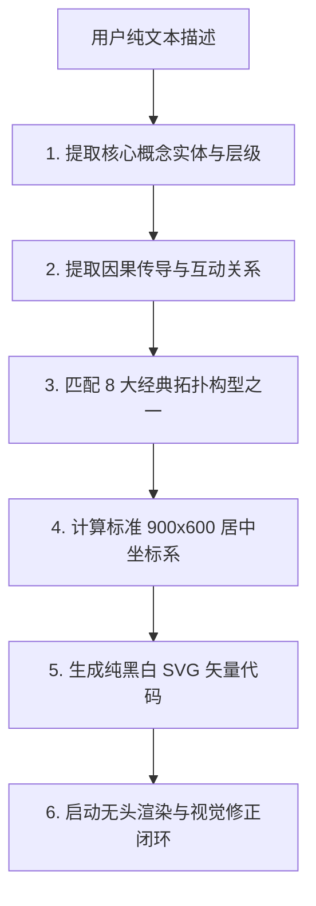

# 学术机制图核心绘图参考手册 (Academic Mechanism Drawing Reference)
> **来源基准**：本手册基于 `source_images/` 目录下 100+ 张顶刊 (CSSCI/SSCI) 原始论文机制图、框架图深度扫描提炼而成。
> **核心用途**：支持用户**仅输入纯文字描述**，大模型即可根据本手册的语义特征匹配最契合的因果构型，自动化生成顶级学术期刊出版级矢量 SVG，并执行闭环自检。

---

## 一、从纯文字到机制图的转译引擎 (Text-to-Diagram Engine)

当用户输入一段学术文字、理论假设或分析逻辑时，按以下四步自动转译出图：

---

## 二、8 大学术因果机制构型库 (8 Core Paradigms)

### 模式 1：时序因果链 (Sequential Causal Pipeline)
* **文本特征词**：“首先...随后...促使...最终实现...反馈调节”、“输入-过程-产出”、“C-M-A-O 模型”、“PDCA 循环”。
* **适用场景**：政策落实链条、技术转化流程、动态演变时序机制。
* **几何排布参数**：
  * 画布：`900 x 600`，整体水平居中。
  * 卡片数量：3 ~ 5 个并列矩形，标准尺寸 `w=150~180`, `h=100~120`。
  * 间距计算：`gap = (760 - N * w) / (N - 1)`，起始坐标 `start_x = (900 - 760) / 2 = 70`，`y = 240`。
  * 连接线：水平主干箭头 `<line>`，底部配置贯穿全图的长虚线反馈回路 `<path>`（与卡片底部保留至少 40px 间距）。

---

### 模式 2：多层级纵向传导架构 (Multi-Tier Hierarchical Framework)
* **文本特征词**：“宏观制度/环境...中观组织/平台...微观主体/行动”、“自上而下推进”、“目标层-机制层-实践层”、“支撑体系”。
* **适用场景**：国家治理体系、产业政策推进架构、多尺度空间规划。
* **几何排布参数**：
  * 画布：`900 x 600`，垂直三层或四层排布。
  * 层级外框：每层大容器 `w=760~800`, `h=100~140`, `x=50~70`。
  * 垂直分布：
    * 顶层 (宏观/目标)：`y=70, h=100`
    * 中层 (中观/机制)：`y=210, h=140`
    * 底层 (微观/实践)：`y=390, h=100`
  * 层间连接：大容器之间通过中轴线上的粗实心箭头垂直贯通（`stroke-width="2"`）。

---

### 模式 3：多元主体网络与博弈拓扑 (Multi-Actor Interaction Network)
* **文本特征词**：“政府、企业、高校与公众多方协同”、“行动者网络 (ANT)”、“三元博弈”、“网络化治理”、“资源交互”。
* **适用场景**：政产学研用创新网络、基层治理多元共治、跨部门协同机制。
* **几何排布参数**：
  * 画布：`900 x 600`，以 `(450, 300)` 为绝对中心。
  * 节点构型：正三边形、正四边形或正五边形均匀分布于半径 `R=180~220` 的圆周上。
  * 中心核心：中心放置核心政策/平台/中枢节点（虚线椭圆或深底圆卡片）。
  * 连线：外围主体间双向实线互联，外围主体与中心中枢间以虚线辐射箭头相连。

---

### 模式 4：多力向心汇聚动力学 (Centripetal Convergence Dynamics)
* **文本特征词**：“顶层牵引力、内在驱动力、外在拉动力、底层助推力”、“多动力协同驱动”、“推拉效应”。
* **适用场景**：改革动力机制、创新驱动机理、行为动机分析。
* **几何排布参数**：
  * 中心目标：椭圆/圆卡片位于 `(450, 300)`，尺寸 `rx=100~120, ry=55~65`，深灰/反白强调。
  * 四周动力源：
    * 上方卡片 (顶层)：`x=350, y=70, w=200, h=90`（垂直向下箭头）
    * 下方卡片 (底层)：`x=350, y=440, w=200, h=90`（垂直向上箭头）
    * 左侧卡片 (内驱)：`x=70, y=255, w=200, h=90`（水平向右箭头）
    * 右侧卡片 (外拉)：`x=630, y=255, w=200, h=90`（水平向左箭头）

---

### 模式 5：二维坐标演进阶梯 (Coordinate Steps & S-Curve Evolution)
* **文本特征词**：“演变历程”、“阶段跃迁”、“从初级到成熟”、“能力爬坡”、“S型增长曲线”。
* **适用场景**：数字化转型阶段、制度变迁历史演进、技术成熟度跃迁。
* **几何排布参数**：
  * 坐标系：原点 `(130, 500)`，Y轴向上至 `y=70`，X轴向右至 `x=820`。
  * 阶梯卡片：3 个阶梯卡片依次在对角线上抬升（如 `x=160,y=380` $\rightarrow$ `x=385,y=260` $\rightarrow$ `x=610,y=140`）。
  * 连接规范：阶段之间使用**正交阶梯折线**对接边缘；宏观 S 演进曲线必须**悬浮于卡片上方 30px 以上**，严禁穿透卡片！

---

### 模式 6：闭环循环与卫星运转 (Closed-Loop Circulation & Satellite Orbit)
* **文本特征词**：“全生命周期”、“资源循环再生”、“输入-利用-回收-再制造”、“生态闭环”。
* **适用场景**：绿色循环经济、供应链闭环、可持续发展机制。
* **几何排布参数**：
  * 中心节点：主核位于 `(450, 300)`。
  * 卫星节点：4 个卫星矩形卡片环绕在 `R=190` 的圆周上（上下左右）。
  * 闭环轨迹：顺时针 4 段大圆弧 `<path>` 衔接各卫星，形成无缝衔接的环形动力流。

---

### 模式 7：双核双轨耦合对偶 (Dual-Core Coupling & Alignment)
* **文本特征词**：“双轮驱动”、“数字赋能与制度创新双轨推进”、“供给侧与需求侧耦合”、“双重逻辑”。
* **适用场景**：双变量互动机制、对称制度分析、供需匹配模型。
* **几何排布参数**：
  * 左右对称布局：左轨系统 (`x=80~400`) 与 右轨系统 (`x=500~820`) 平行推进。
  * 中轴耦合区：`x=410~490` 中间区域放置双向交互连线、啮合齿轮或对接漏斗。

---

### 模式 8：四象限矩阵与交叉分类 (2x2 Matrix & Quadrant Typology)
* **文本特征词**：“两维度四类型划分”、“高/低交叉”、“四象限分类治理”、“策略矩阵”。
* **适用场景**：企业战略分类、政策工具箱矩阵、主体行为类型学。
* **几何排布参数**：
  * 十字坐标轴：交叉于中心 `(450, 300)`。
  * 4 个象限区域：各放置一个宽大的象限卡片，内含类型名称与核心特征列表。

---

## 三、SVG 制图通用物理规格 (Standard Specs)

1. **绝对禁止任何图表标题与边角注释**（如“图1”、“作者自制”等）。
2. **严格纯白底黑字与字体层级规范 (SimHei & Bold FangSong)**：
   * **绝对严禁任何灰色背景或深色背景块**（严禁 `#333333`, `#f5f5f5`, `#eeeeee` 等灰度填充，严禁文字反白）；
   * **强调项采用黑体 (SimHei)**：主模块/核心概念通过**大字号（`20px ~ 24px`）黑体**突出，保持标准字重，清秀雅致（字体栈：`'SimHei', 'Heiti SC', 'Microsoft YaHei', sans-serif`）；
   * **次级/非强调项采用加粗仿宋 (Bold FangSong)**：次级节点、括号指标、连线说明统一使用 `'FangSong', 'STFangsong', 'SimSun', serif` 并添加 `font-weight="bold"`（字号 `14px ~ 16px`），兼具学术古雅感与清晰可读性；
   * 所有卡片/图形容器：`fill="#ffffff"` 或 `fill="none"`；
   * 所有文本文字：`fill="#000000"`；
   * 所有边框与线条：`stroke="#000000"`。
3. **动态自适应固定画布尺寸体系 (Dynamic Sizing Formulas)**：
   * **标准因果模型 (4~6 节点)**：`viewBox="0 0 900 600" width="900" height="600"`
   * **大型三元/多元综合治理架构 (左困境+中复合机制+右效能+底回路)**：`viewBox="0 0 1320 720" width="1320" height="720"`（左框 215px、中框 590px、右框 215px、走廊 80px）
   * **长时序流程链 (5~7 阶段)**：`viewBox="0 0 1200 650" width="1200" height="650"`
   * **纵向多层级架构 (4~6 层级)**：`viewBox="0 0 900 1000" width="900" height="1000"`
   * **正方/环形网络系统**：`viewBox="0 0 800 800" width="800" height="800"`
   * **声明原则**：`width="{W}" height="{H}"` 必须与 `viewBox="0 0 {W} {H}"` 严格绑定，严禁 `width="100%"`。
4. **外围大边框样式选项 (Outer Frame Styles)**：
   * 实线外框 (`<rect x="40" y="40" width="{W-80}" height="{H-80}" rx="8" fill="none" stroke="#000000" stroke-width="1.8" />`) / 虚线外框 / 无外框开放画布。
4. **曲线安全净空 (Clearance)**：
   * 任何全局贝塞尔曲线与下方卡片顶点之间必须留出至少 `30px ~ 50px` 的净空，严禁切割文字！
5. **字与图形元素黄金间距规范 (Text-to-Element Spacing)**：
   * **卡片内边距 (Padding)**：文字基准线离卡片上下左右必须保持 `12px ~ 20px`（严禁贴边 `<8px` 显得窒息，严禁留白 `>30px` 显得涣散）；
   * **连线文字间距 (Line Offset)**：说明文字与对应线条/箭头保持 `8px ~ 12px` 垂直偏移行距（严禁压线，严禁 `>20px` 导致归属不清）；
   * **多行文本行距 (Line Height)**：同一框体内多行文字垂直间距保持在 `22px ~ 28px`。
6. **元素与元素实体间黄金间隙规范 (Inter-Element Clearance)**：
   * **实体间呼吸间隙 (Gap)**：任何相邻的卡片、圆环节点、齿轮轨道之间必须预留 `25px ~ 45px` 物理间隙，严禁无间隙硬贴合或相切；
   * **分箱边界衬垫 (Margin)**：大容器外框与内部嵌套子元素之间四周保留至少 `20px` 的安全留白。

---

## 四、出图后必须执行的强制自检闭环 (Verification Loop)

当 SVG 代码生成后，**绝不允许直接输出结束**，必须在后台执行以下自检与修复循环：

1. **无头渲染**：调用 `python scripts/render_svg.py temp.svg temp.png` 将 SVG 转为真实 PNG。
2. **视觉自查 (5大必检项)**：
   * [ ] **居中检查**：图表整体包围盒是否对称居中于 900x600 画布？（四周留白是否均匀？）
   * [ ] **穿透重叠检查**：贝塞尔曲线、直线是否切割了任何文字？框体是否相互覆盖？
   * [ ] **字号可读性**：是否存在小于 14px 导致看不清的文字？
   * [ ] **红线检查**：是否误加了图表标题或作者注释？是否存在彩色？
   * [ ] **边界溢出**：文字是否溢出了矩形框？
3. **修正迭代**：若有任何一项不达标，必须立即在代码中微调坐标参数，重新执行渲染，直至 100% 完美后方可输出！
